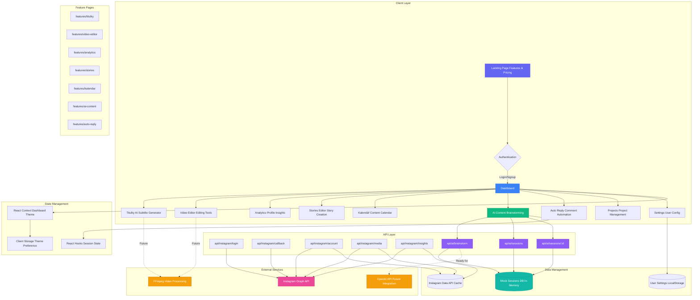

# SocialMat - AI-Powered Content Creation Platform

SocialMat is a comprehensive AI-powered platform designed specifically for short-form content creators, especially those focusing on Instagram. The platform automates video editing tasks including subtitle generation, animations, sound effects, and provides content ideation and caption generation.

## ✨ Features

### 🎬 AI Video Processing
- **Auto Subtitles**: AI-powered subtitle generation with customizable styling
- **Smart Animations**: Dynamic transitions and effects for engaging content
- **Sound Enhancement**: Background music and sound effect integration
- **Video Filters**: Professional-grade color correction and enhancement

### 🎯 Content Generation
- **Video Ideas**: AI-generated content ideas based on trending topics
- **Smart Captions**: Viral-ready captions with hashtags and CTAs
- **Multiple Tones**: Support for casual, professional, funny, inspirational styles
- **Category Filtering**: Ideas tailored to lifestyle, educational, trending, and entertainment content

### 📊 Analytics Dashboard
- Project tracking and management
- Estimated view potential
- Time saved analytics
- Completion progress monitoring

### 🖼️ Video Gallery
- Organized view of completed projects
- Quick access to edit processed videos
- Project metadata and settings overview

## 🚀 Getting Started

### Prerequisites
- Node.js 18+ 
- npm or yarn

### Installation

1. Clone the repository:
```bash
git clone <repository-url>
cd socialmat.app
```

2. Install dependencies:
```bash
npm install
```

3. Run the development server:
```bash
npm run dev
```

4. Open [http://localhost:3000](http://localhost:3000) in your browser.

## 🛠️ Tech Stack

- **Frontend**: Next.js 15, React 19, TypeScript
- **Styling**: Tailwind CSS
- **Video Processing**: FFmpeg (planned integration)
- **AI Integration**: OpenAI API (configured)
- **State Management**: React Context + Hooks

## 🏗️ Architecture Diagram



### Architecture Layers

#### 🎨 Client Layer
- **Landing Page**: Marketing pages with feature showcases
- **Authentication**: Login/Signup flow with session management
- **Dashboard**: Main application hub with navigation
- **Feature Modules**: 9 specialized tools for content creation

#### 🔌 API Layer
- **Instagram Integration**: OAuth flow, account data, media management, insights
- **AI Services**: Chat brainstorming, session persistence, conversation history
- **RESTful Design**: Standard HTTP methods (GET, POST, PUT, DELETE)

#### 💾 Data Management
- **Session Storage**: In-memory mock database (ready for PostgreSQL/MongoDB)
- **Client Storage**: Theme preferences, user settings
- **API Cache**: Instagram data caching for performance

#### 🌐 External Services
- **Instagram Graph API**: Profile data, media, insights, stories
- **OpenAI API**: Configured for AI chat (ready for integration)
- **FFmpeg**: Planned for video subtitle generation and editing

#### 🔄 State Management
- **Dashboard Theme**: React Context for dark/light mode
- **Session State**: React hooks for AI chat conversations
- **Persistence**: LocalStorage for user preferences

## 📁 Project Structure

```
src/
├── app/                    # Next.js app directory
│   ├── api/               # API routes
│   │   ├── ai/
│   │   │   ├── brainstorm/        # AI chat endpoint
│   │   │   └── sessions/          # Session management
│   │   │       └── [id]/          # Individual session CRUD
│   │   └── instagram/
│   │       ├── login/             # OAuth initiation
│   │       ├── callback/          # OAuth callback
│   │       ├── account/           # Account data
│   │       │   └── insights/      # Account insights
│   │       └── media/             # Media endpoints
│   │           └── [mediaId]/
│   │               └── insights/  # Media insights
│   ├── dashboard/         # Protected dashboard pages
│   │   ├── layout.tsx
│   │   ├── page.tsx              # Main dashboard
│   │   ├── titulky/              # Subtitle generator
│   │   ├── aicontent/            # AI brainstorming
│   │   ├── projects/             # Project management
│   │   ├── settings/             # User settings
│   │   └── instagram-connect/    # Instagram setup
│   ├── features/          # Marketing feature pages
│   │   ├── titulky/
│   │   ├── video-editor/
│   │   ├── analytics/
│   │   ├── stories/
│   │   ├── kalendar/
│   │   ├── ai-content/
│   │   └── auto-reply/
│   ├── login/             # Auth pages
│   ├── signup/
│   ├── privacy/           # Legal pages
│   ├── data-deletion/
│   ├── actions/           # Server actions
│   │   └── auth.ts
│   ├── globals.css
│   ├── layout.tsx
│   └── page.tsx           # Landing page
├── components/            # React components
│   ├── dashboard-theme.tsx       # Theme context
│   ├── Dashboard.tsx             # Main dashboard
│   ├── DashboardWrapper.tsx      # Dashboard layout
│   ├── Navbar.tsx                # Main navigation
│   ├── FeatureNavbar.tsx         # Feature pages nav
│   ├── Sidebar.tsx               # Dashboard sidebar
│   ├── SessionSync.tsx           # Session management
│   ├── VideoUploader.tsx         # Video upload
│   ├── SubtitleGenerator.tsx     # Subtitle UI
│   ├── VideoPlayer.tsx           # Video playback
│   ├── VideoInfo.tsx             # Video metadata
│   ├── ProjectsPanel.tsx         # Projects list
│   └── ui/                       # Shadcn components
│       ├── avatar.tsx
│       ├── badge.tsx
│       ├── button.tsx
│       ├── card.tsx
│       ├── dialog.tsx
│       ├── dropdown-menu.tsx
│       ├── input.tsx
│       ├── label.tsx
│       ├── separator.tsx
│       ├── skeleton.tsx
│       ├── sonner.tsx
│       └── tabs.tsx
└── lib/                   # Utility functions
    ├── api.ts             # API client
    ├── fetcher.ts         # Data fetching
    └── utils.ts           # Helpers
```

## 🎨 Key Components

### VideoUploader
Handles video file uploads with drag-and-drop support and real-time processing feedback.

### VideoEditor
Provides comprehensive editing controls for:
- Subtitle customization
- Animation settings
- Sound effect management
- Video filters and color correction

### ContentGenerator
AI-powered content generation featuring:
- Video idea suggestions
- Caption generation with multiple tones
- Hashtag optimization
- Call-to-action recommendations

### VideoGallery
Showcases completed projects with:
- Visual project previews
- Metadata display
- Quick editing access
- Processing status indicators

## 🌟 Features in Detail

### AI Subtitle Generation
- Automatic speech-to-text conversion
- Multiple styling options (modern, classic, bold, minimal)
- Customizable positioning and animations
- Real-time preview

### Smart Content Ideas
- Trend-based suggestions
- Difficulty ratings
- View potential estimates
- Category-specific ideas (lifestyle, educational, trending, entertainment)

### Caption AI
- Tone-aware generation (casual, professional, funny, inspirational)
- Hashtag optimization
- Emoji suggestions
- Call-to-action integration

## 🔧 Configuration

### Environment Variables
Create a `.env.local` file with:
```
OPENAI_API_KEY=your_openai_api_key_here
```

### Video Processing
The application is configured to support various video formats:
- MP4, MOV, AVI, MKV, WebM

## 📈 Performance

- **Fast Upload**: Optimized file handling with progress tracking
- **Efficient Processing**: Chunked video processing for better performance
- **Real-time Updates**: Live progress indicators and notifications
- **Responsive Design**: Mobile-first approach for content creators on-the-go

## 🚧 Roadmap

- [ ] Real FFmpeg integration for video processing
- [ ] Advanced AI model integration for better content suggestions
- [ ] Social media platform integrations
- [ ] Batch processing capabilities
- [ ] Advanced analytics and insights
- [ ] Collaboration features
- [ ] Mobile app development

## 🤝 Contributing

1. Fork the repository
2. Create your feature branch (`git checkout -b feature/AmazingFeature`)
3. Commit your changes (`git commit -m 'Add some AmazingFeature'`)
4. Push to the branch (`git push origin feature/AmazingFeature`)
5. Open a Pull Request

## 📄 License

This project is licensed under the MIT License - see the LICENSE file for details.

## 💡 Support

For support and questions:
- Create an issue on GitHub
- Join our Discord community
- Email: support@socialmat.app

---

**Built for content creators, by content creators** 🎬✨
